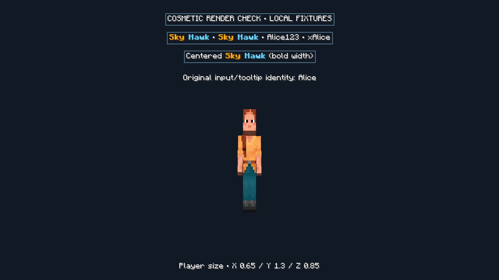

# Linked Discord cosmetics — Sky-Hawk 2.4.2

The existing Discord application and Cloudflare Worker are reused. News still reads channel **1552585927086440459** through its existing read-only REST/cache path. Its code, test and Wrangler configuration are unchanged by this extension. Cosmetics use signed HTTP interactions at `/discord/interactions`, not a new gateway bot or a channel-message listener.

## Player flow

1. Join Hypixel with the updated mod and authenticated relay, then use `/sm cosmetics link` (also `/skymyce cosmetics link`). The private mod screen shows a **12-character code**, grouped as `XXXX-XXXX-XXXX`, a five-minute expiry/countdown, and Copy.
2. In **bot-commands, channel 1552057526969835612**, use the existing bot's `/cosmetics link code:<code>`. Hyphens are optional and case does not matter. The response is ephemeral. Do not post the code as an ordinary channel message.
3. Use the commands below. Changes persist in Cloudflare and push to subscribed clients. `/sm cosmetics` shows the synchronized settings and has an explicit refresh button.

| Discord command | Behavior |
| --- | --- |
| `/cosmetics show` | View only the caller's linked UUID and settings. |
| `/cosmetics set name:<text or JSON>` | Set a cosmetic name, up to 32 visible UTF-16 characters. Whitespace-only input clears the name. |
| `/cosmetics set x:0.8` | Change X width only; Y and Z stay unchanged. |
| `/cosmetics set y:1.2 z:0.9` | Change height/depth independently. Each axis must be finite and within 0.5–2.0. |
| `/cosmetics reset` | Clear the name, restore all axes to 1.0, keep the account link. |
| `/cosmetics unlink confirm:true` | Remove the caller's link, revoke outstanding codes for that UUID and reset cosmetics. |

There is no target-player/IGN/UUID option, including for administrators. A signed Discord identity alone cannot claim a Minecraft identity. Only a challenge issued through that Minecraft UUID's authenticated relay session authorizes linking.

Codes use 60 bits of cryptographic randomness and are stored only as SHA-256 hashes. At most one live challenge exists per UUID, issued at most once a minute. Requesting a fresh code invalidates the old one. Expired/reused/revoked codes fail without changing ownership. Consumption and link changes are transactional; concurrent use succeeds once.

Relinking the same Minecraft account with a fresh in-game code transfers it to the new Discord owner and immediately revokes the old owner's access. Existing cosmetics remain. A Discord account already linked to a different Minecraft UUID must explicitly unlink first; rejection does not consume the new code. Unlinking resets cosmetics with a newer revision, so old clients/caches cannot resurrect the previous appearance. Unlinked users cannot change settings until they complete a fresh challenge.

## Styled names and client display

Plain names and a safe subset of Minecraft text-component JSON are supported. For example, the value of the name option can be:

```json
{"text":"Sky","color":"gold","bold":true,"extra":[{"text":" Hawk","color":"#67ccf2","italic":true}]}
```

Allowed fields: `text`, `color`, `bold`, `italic`, `underlined`, `strikethrough`, `extra`. Colors are Minecraft named colors or `#RRGGBB`. The entire JSON input is limited to 2 KiB, 16 nodes and depth four; displayed text is limited to 32 characters and normalized. Names accept letters/numbers, Unicode symbols such as `✦`, `☠`, `♥`, common separators `•·»«`, spaces, apostrophes, dots, underscores and hyphens. A symbol only displays if Minecraft's active font has a glyph for it. Controls, `§` formatting codes, `@` mentions, click/hover events, insertion, obfuscation, custom fonts, translations, selectors, NBT and arbitrary resources are rejected. Both Worker and mod validate the payload.

**Show Cosmetic Names** replaces only complete known Minecraft username tokens, case-insensitively. `Alice` changes, while `Alice123`, `xAlice` and `Alice_` do not. Style boundaries inside a username do not prevent a match. Original rank/team formatting around the name remains; existing click actions keep their original real-name command targets. Replacement names are not recursively treated as another player's real name.

The mod reuses bounded UUID lookups on the existing authenticated relay. Current UUID/name pairs come from Minecraft's current tab-roster GameProfiles and the logged-in account, so no additional Mojang API calls are needed. The session cache holds at most 512 username entries. Unknown/unresolved identities stay unchanged until seen; the complete relay registry is not downloaded. New roster players are picked up by the existing once-per-second bounded synchronization. Public settings refresh at most every five minutes and live revisions apply immediately. Cached cosmetics expire after ten minutes without refresh and clear on leaving Hypixel/account change.

| Surface | Effect |
| --- | --- |
| Player nametags, tab list, vanilla chat text, titles/action bar, scoreboard text, Sky-Hawk/owo labels using Minecraft Font | Display-only complete-name replacement. Width calculations and component line wrapping use the styled displayed text. |
| Item and other hover tooltips | Original names by default, controlled by **Keep original names in item tooltips**. The option also preserves other hover tooltips for consistent identity inspection. |
| Chat command/search text boxes | Original editable text and cursor measurements remain unchanged. |
| Account-linking screen | Explicit real identity, codes and synchronized settings remain literal. |
| Gameplay packets, authentication, friend/party/API routing, received components, scoreboard/team data, item NBT/lore, copied commands and stored chat | Original UUID/username/data remain authoritative. No broad mutation or replacement of source data. |
| External mods bypassing Minecraft Font, images/textures, unresolved players, first-person hands | Not changed. Custom third-party text caches may require reopening their UI to relayout. |

The hooks make display copies at the Font boundary, with matching width/layout inputs and bounded caches. They do not contact a service or resolve usernames during rendering. Existing chat is reflowed when the mapping/toggle changes. A cosmetic name can resemble another player; use original tooltip names, the toggle, and real command identities when inspecting/reporting an account.

Player size uses the vanilla render pose and attached armor/held-item layers. Vanilla restores the pose after drawing. Collision boxes, reach, movement, physics, camera and packets are unchanged. Supporting enabled clients see these cosmetics; unmodified clients do not. No claim of Hypixel approval is made.

## Operator setup and exact permissions

No production deployment, secret changes or Discord registration is performed by the implementation/tests. These are operator steps for the existing application:

1. Keep the existing application's bot, news token, news-channel permissions, `DIGEST_GAME_CHANNEL=1552585927086440459`, Alpha configuration and news ingestion exactly as configured. Do not reinstall a different bot or remove existing scopes/intents.
2. Ensure the existing application is installed to the guild with **`applications.commands`**. In channel **1552057526969835612**, players need **View Channel** (`VIEW_CHANNEL`) and **Use Application Commands** (`USE_APPLICATION_COMMANDS`). Allow the bot/app View Channel there. Cosmetic commands need no Read Message History, Send Messages, Manage Messages, Administrator, member/presence intent or Message Content intent: requests and ephemeral responses use signed HTTP interactions. The existing news reader keeps its current permissions/intents separately.
3. In Discord Server Settings → Integrations → the existing app → command permissions, restrict **cosmetics** to the bot-commands channel. Worker-side channel enforcement is authoritative even if this UI restriction is omitted. DMs, the news channel and thread IDs are rejected. Restrict only this command, not unrelated commands.
4. Configure `DISCORD_APPLICATION_ID` and `DISCORD_PUBLIC_KEY` for this same Discord application. The public key is its Ed25519 interaction verification key, **not** a bot token. `DISCORD_INTERACTIONS_ROOM` defaults to `friends` and must match the production clients' allowed relay room. `COSMETICS_COMMAND_CHANNEL` defaults to `1552057526969835612`; only override it for isolated staging. The existing `ROOMS`, `RELAY_ROOMS` SQLite binding and compatibility date remain unchanged. No new paid service or binding is required.
5. Tokens/service credentials belong in **Wrangler secrets**, never `vars`, the client, Git, a command argument or a screenshot. Keep the existing `DISCORD_NEWS_TOKEN` untouched. Cosmetics interaction verification requires no bot token. Trusted application configuration may also be provisioned with `npx wrangler secret put DISCORD_APPLICATION_ID` and `npx wrangler secret put DISCORD_PUBLIC_KEY` using Wrangler's private prompts. Do not run these against production without authorization: `secret put` creates and deploys a new Worker version.
6. Validate locally: `npm ci`, `npm run check`, `npm test` in `relay`. `npm test` bundles with `wrangler deploy --dry-run` and runs Miniflare; it does not deploy. Use a separate staging Worker/application/channel/room for an external smoke test. Never point staging links or commands at production storage.
7. After approval, deploy the intended environment with `npm run deploy` and set the Discord application's **Interactions Endpoint URL** to `https://<existing-worker-host>/discord/interactions`. Signed PING is supported. If the application already uses a separate interaction endpoint outside this checkout, its handler must be integrated/routed first; do not silently overwrite that external service. The repository news integration itself uses REST and has no gateway/competing interaction handler.
8. Run `node scripts/register-cosmetics.mjs` for a local definition preview. After approval, register with `--apply`, using protected operator-environment injection of `DISCORD_APPLICATION_ID`, the same bot's `DISCORD_BOT_TOKEN`, and optionally `DISCORD_COMMAND_GUILD` for a guild-scoped command. The one-time registration credential is not persisted by the script; runtime credentials remain in Wrangler secrets. No secret values are printed. The script GETs commands and PATCHes/POSTs **only cosmetics**, preserving unrelated commands. Re-register to remove the former `target` and uniform `scale` options.

References: [Discord HTTP interaction signatures and ephemeral responses](https://docs.discord.com/developers/interactions/receiving-and-responding), [Discord command registration/permissions](https://docs.discord.com/developers/interactions/application-commands), [Discord permission flags](https://docs.discord.com/developers/topics/permissions), [Wrangler secrets](https://developers.cloudflare.com/workers/configuration/secrets/).

## Storage, compatibility and validation

The existing `cosmetics_public` table gains nullable `name_json` and axis columns. Old uniform scales are read as all three axes until updated. Migration checks column names and is additive/idempotent; UUID ownership, revisions and old rows are retained. Link/replay/rate/audit tables remain private. New public records contain no Discord IDs, challenge hashes, tokens or audit information.

Clients negotiate `cosmeticsVersion:2`. Version-1 clients still receive their original five fields (the Y value is their uniform-scale compatibility approximation); they cannot render styled names/independent axes. Names exceeding their old 24-character limit fall back to the real IGN on those clients. New clients accept old records as plain names/uniform sizes. Short-code management requires the updated client. Live push, snapshot ordering, reset revisions and hibernating subscriptions reuse the existing protocol. Management commands are limited to six per Discord user per minute; WebSocket lookups retain their existing burst/refill limits. No chat or private-message history is added.

Automated checks cover signed/tampered/stale interactions, wrong channels/DMs, self-only ownership, short-code expiry/replay/concurrent consumption/relink/unlink, per-axis preservation, style rejection, legacy schema migration across repeated hibernation, protocol compatibility and revisioned resets. Client checks cover extended/legacy payloads, malicious text components, styled widths, complete-token boundaries across component styles, unchanged click targets, no recursive replacement and cache invalidation.

Live Discord registration/linking and two authenticated Hypixel clients still require operator setup and testing. Verify A's name/XYZ on B, including armor/held items, sneak/swim poses, reconnect, disable toggles, name reset, unlink and leaving Hypixel. Confirm news continues updating in `1552585927086440459`. Local rendered validation and final check results are recorded in the delivery report; no production behavior is claimed from the local harness alone.

### Local validation, 2026-09-25

- `gradlew.bat --offline build`: passed, including the existing Kotlin assertion runners and the new cosmetics checks. Log: `build/cosmetics-expansion-build.log`; artifact: `build/libs/skymyce-2.4.2.jar`.
- `npm run check` and `npm test`: passed, including signed Discord requests, real local WebSockets, SQLite migration and hibernation in Miniflare. Logs: `build/cosmetics-expansion-relay-check.log`, `build/cosmetics-expansion-relay-test.log`. The existing lockfile installation was already verified; dependencies were unchanged.
- Registration script syntax and definition dry run passed; no command registration was performed. `git diff --check` passed.
- The muted 1920×1080 Minecraft 26.1.2 client loaded the production mixins and rendered a local fixture at GUI scale 3. The screenshot shows styled whole-token replacement, centered displayed widths, explicit original-text suppression and XYZ sizing. The fixture is not a live Discord session or a complete tooltip/two-player validation. Temporary fixture code was removed and its absence checked in the final JAR.
- SHA-256 checks confirmed `relay/src/digest.ts`, `relay/test/digest.mjs` and `relay/wrangler.jsonc` are unchanged from the start of this task, preserving pre-existing local changes.


