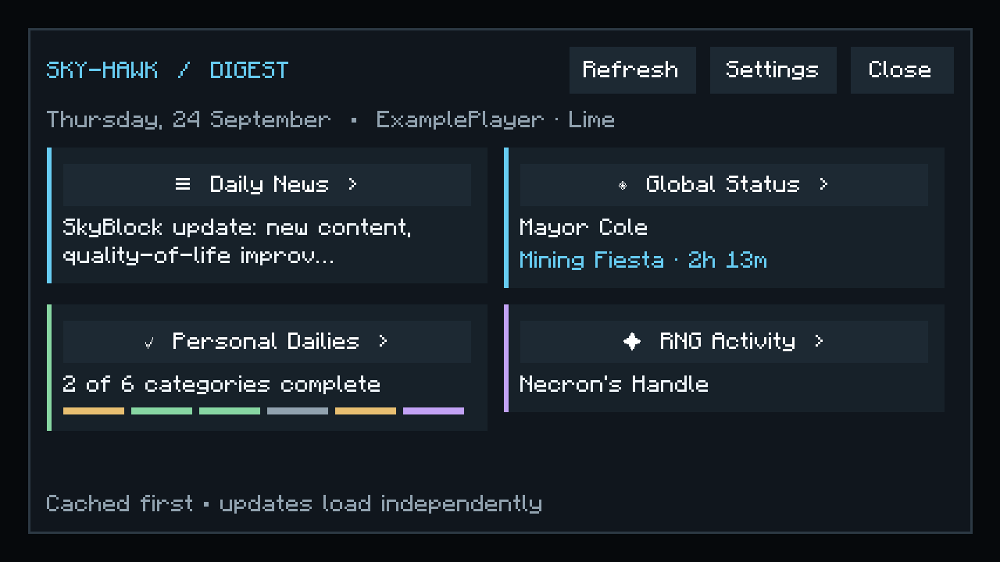

# Sky-Hawk Daily Digest

Open `/sm digest` or `/skymyce digest` after joining SkyBlock. The dashboard has four cards: Daily News, Global Status, Personal Dailies, and RNG Activity. Each opens its own scrollable detail page. The interface uses the existing owo menu/HUD components and palette, Minecraft GUI scaling, keyboard-focusable controls, and no animated transitions.



Actual development-client render at GUI scale 3; the screenshot uses example data, not live news or account information.

## Daily opening and profiles

Automatic opening is enabled by default, once per **local computer day and Minecraft account**, after an eight-second settling delay. Change the delay (3–30 seconds) or disable automatic opening under **General → Daily Digest**. The digest waits for SkyBlock, a loaded profile, and an unobstructed game screen. Existing menus are not replaced. Opening it manually also counts for that day.

The local date and next midnight use the computer's current timezone, including daylight-saving transitions. Switching profiles does not reopen a digest already shown that day. Activity records and RNG history are separated by account UUID, profile name, and main/Alpha environment, matching SkyBlock API's profile storage convention. Unknown profiles never receive another profile's detections.

State is stored in `config/skymyce/daily_digest.json`. Reads and atomic temporary-file replacement run on the existing background scheduler, with a coordinated background shutdown flush for pending changes. Malformed files recover to an empty state without crashing; the damaged original is backed up before replacement. The file is size bounded, with at most 64 saved account/profile contexts. No profile HTTP lookup is needed for personal daily tracking.

## What each card knows

| Card/activity | Source and limits |
| --- | --- |
| Daily News | Cowshed Game Updates and Alpha Updates through the configured read-only relay bridge. Both sources can be toggled separately. Eight recent items per source are cached; full bounded text expands in the submenu. Source links require confirmation. |
| Mayor | Existing SkyBlock API election cache, including active mayor/minister perks. The timestamp is when a new cached API response was observed, not a new digest-specific API call. Old observations are labelled. |
| Events | Actual Calendar and Events menu observations, plus a live Spooky Festival scoreboard timer. Mining Fiesta and other named events appear when detected. Unknown schedules stay unknown; timers never invent a start or duration. |
| Forge | Relevant Forge inventory events capture up to seven slots: active, complete, empty, locked, or unknown. Remaining time is calculated locally. Open The Forge to initialize or refresh the observations. |
| Experimentation / Superpairs | A confirmed reward claim records completion; actual table lore determines available charges or cooldown. A claim alone does not imply that bonus/stored charges are exhausted. |
| Puzzler | The puzzle reward message starts its 24-hour cooldown. No reward observation means unknown. |
| Fetchur | Confirmed completion/already-completed NPC responses, resetting at midnight UTC-5. This is separate from the digest's local midnight. |
| Dungeon daily activities | Locally observed started runs followed by Catacombs XP, against the five-run daily counter and UTC reset. Failed runs can also award XP, so these observations alone do **not** claim the daily bonus is complete. Other clients' runs are not inferred. A manual note is available. |
| Mayor activities | Observed active calendar events. Event participation or completion is not inferred from the mayor's presence. |

Puzzler, Fetchur, experiments, and dungeon activities support explicitly labelled manual completion notes and clearing those notes. Expired manual notes return to unknown, not verified-ready. Tooltips explain the evidence for each state. Green means ready/complete, yellow means active/waiting, cyan means information, red indicates unavailability, purple/gold marks special events, and grey indicates unknown/loading data.

## News service setup

News requires external Discord setup. The mod contains **no Discord credentials**. Cowshed's maintainer supports [following announcement channels into your own server](https://cowtipper.de/moonitor); there is no documented public Moonitor API. See the [relay setup instructions](../relay/README.md#daily-digest-news-and-rng) for following both channels, configuring a read-only bot, storing its token as a Cloudflare secret, and setting the two channel IDs. Following channels does not necessarily backfill historical announcements.

Before configuration, the news card says that the bridge is unavailable. The rest of the dashboard remains usable. Client news requests are deduplicated, with a five-minute cache and at least a one-minute retry interval. The relay shares a five-minute cache, fetches only newer messages, and backs off after failures. Closing the menu cancels unnecessary client requests. Network errors preserve saved news and its last successful update timestamp.

## RNG privacy and scope

**Sharing and receiving are both off by default.** These are independent settings. Public Minecraft names are also off by default; anonymous reports display `Anonymous`. Enabling sharing never uploads old history.

The initial detector supports seven rare dungeon items (Necron's Handle, Giant's Sword, Dark Claymore, Shadow Fury, and the three Wither scrolls) and three Slayer drops (Warden Heart, Judgement Core, Overflux Capacitor). Dungeon announcements require a matching increase in carried inventory count before publication; a reward preview alone is insufficient. Ordinary loot is ignored. Kuudra and fishing are not claimed as supported until a reliable acquisition detector is added.

Only a random/deterministic event identifier, allowed item ID, activity category, occurrence time, and name-visibility preference are submitted through the existing authenticated relay. The server supplies the authenticated public name or `Anonymous` and publishes a separate opaque event ID. Minecraft's signed account proof is reused; Hypixel credentials are not required.

No inventory contents, raw chat, coordinates, purse/bank, friend list, private API data, or IP-address field is sent in event payloads. The server retains the authenticated account UUID privately for deduplication and abuse prevention; it is never broadcast. Network connections inherently reveal their source address to the hosting provider, but the digest does not collect or add it to reports.

Community reports are always labelled **unverified**: authentication establishes the reporting account, not proof of a drop. The relay validates allowed fields, item/activity pairs, timestamp age, sizes, and a maximum of three new reports per account per minute. Subscriptions are opt-in and retain no more than 200 public events/seven days on the relay, with at most 30 delivered initially. Anonymous mode does not expose the account UUID or original client event ID to other players.

Local history is newest-first, searchable by item or player, filterable by activity, and paginated. Personal retention is configurable from 20–500 events per profile (default 100). A separate 30-event community cache cannot evict personal drops. Clear Local removes that profile's saved history after confirmation. It does not retract reports already shared publicly; changing name visibility affects future reports. The feature sends no chat messages or automatic congratulations and performs no gameplay actions.

## Architecture and validation

The implementation was built in reviewable stages: repository/baseline audit; retained card/menu foundation; local-day lifecycle and persistence; independent cached sources and activity providers; optional authenticated community feed; visual/performance checks and documentation. Existing Party Finder, Dungeon Friends, wealth sharing, and HUD behavior remain on their existing paths.

- `DailyDigest` coordinates existing SkyBlock/profile/menu events and immutable presentation snapshots.
- `DigestDailyGate` handles date and delayed-opening decisions without Minecraft dependencies.
- `DigestNewsRepository` handles independent Game/Alpha cache states, bounded parsing, cooldowns, cancellation, and stale fallback.
- `DigestActivities` and `DigestRng` consume relevant game events; no periodic inventory scans or profile API requests are introduced.
- `DigestStateStore` performs bounded, recoverable atomic persistence off the client thread; pending writes are coalesced.
- The existing relay adds optional capability-negotiated news/RNG packets. Older relay deployments leave these cards unavailable without affecting party traffic. Digest requests have their own four-request client queue.
- The retained screen updates changed cards only. Countdown labels update once per second **only while the screen is open**; deadlines require no network calls. There are no per-card timers or continuous global polling loops. A single cancellable lifecycle wake handles delayed opening/midnight, with brief bounded retries while initial profile data loads.

Use the existing checks:

```text
gradlew.bat --offline build
cd relay
npm run check
npm test
```

`dungeonFriendsCheck` includes local-day/DST, delayed opening, profile isolation, cache hit/miss/stale/failure/timeout, safe parsing, persistence corruption recovery, privacy, cooldown, and acquisition checks. `hudCheck` includes retained layouts, GUI sizes, long text, safe links, filters, and offline/partial states. Relay tests exercise signed authentication, rate limits, anonymity, subscriptions, source separation, upstream failures, hibernation, bounded retention, and all previous party/stats/wealth scenarios.

Live Hypixel parsing remains dependent on supported English game messages and menu lore. Unsupported or changed formats produce unknown states rather than fabricated completion. No secret-waypoint routing, automation, unrelated daily categories, or social messaging is included.

### Render validation

An isolated offline development client rendered fixture-backed overview, expanded news, Forge, RNG, and offline screens at GUI scales 1, 2, and 3 (1280×720 physical resolution). The short-screen overview shows all four cards at 427×240 logical pixels; detail pages scroll. The temporary fixture launcher was removed from production source afterward.

Across 894 measured UI extraction samples, per-screen medians were 0.043–0.135 ms, the highest p95 was 0.246 ms, and the maximum was 0.414 ms. Warm screen initialization took 1.55–9.05 ms. The first cold development opening took 55.27 ms, so these measurements do **not** establish a zero-spike first launch. Live Hypixel/modpack profiling remains a separate in-game check.

The JFR capture found no render-thread socket events and no digest calls in render-thread file-I/O stacks. JVM/JAR loading and logging still generated ordinary client-thread I/O. Cache/reopen request bounds and separate-source failure behavior are additionally checked by deterministic tests.
