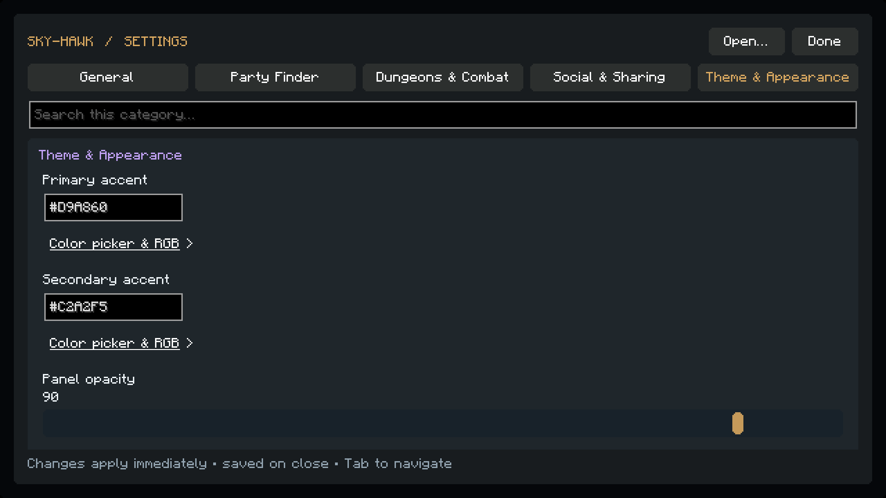

# Settings, theme and Party Finder matcher

Open `/sm` or `/skymyce`, the settings key (Right Shift by default), or the mod's configuration entry in Mod Menu. Settings use the existing owo UI and Resourceful Config values; existing configuration paths remain compatible.



Actual offline development-client render at 1920×1080, GUI scale 3. The gold accent demonstrates customization; the default accent remains cyan.

## Navigation and appearance

The five tabs are **General**, **Party Finder**, **Dungeons & Combat**, **Social & Sharing**, and **Theme & Appearance**. Common settings appear first; expand **More options** for the rest. Search filters names and descriptions within the selected tab. Every setting has a tooltip. Tab/Shift-Tab navigate controls; Enter/Space activates buttons and accordions. Sliders support keyboard input. Lists scroll and tab rows wrap at smaller GUI sizes.

**Open…** groups feature shortcuts in one menu. RNG history entries have one **Share…** menu: Party chat, Guild chat, or Copy report. Chat actions prepare a bounded draft; sending it requires the player's normal confirmation. Community reports retain their **unverified** label even when long text is shortened. There is no public RNG permalink service, so Copy report copies text.

The global primary/secondary accents accept six-digit RGB hex, a color picker, or individual RGB sliders. Panel opacity ranges from 20–100%. Menus, cards, buttons and HUD panels use the shared rounded dark-glass surfaces. Status colors keep their meaning. Existing HUD position and scale controls remain in `/sm hud`. Previous Digest accent/opacity settings migrate once into the global theme, and duplicate theme controls are hidden. Changed settings save when the screen closes.

## Party Finder matching

The **Party Finder** tab controls the chest matcher independently of the `/sm pf` friend menu:

- **Dim incompatible parties** enables the visual overlay.
- **Match open classes** uses explicit open/available/needed class lore when present. Otherwise it treats classes absent from listed members as open. **Classes I play** accepts any selected class; an empty selection uses the current detected class. Unknown class data leaves the class check unrestricted.
- **Match note PB requirements** compares the note requirement to the local player's cached API completion time for that specific floor. Normal and Master Mode floors remain separate. Missing, loading, or zero PBs fail a stated time requirement. Notes without a valid time have no PB restriction.

Opening the chest requests the local player's stats through the existing bounded, asynchronous stats cache. Rendering does not perform HTTP requests or scan the whole friends list. Lore is parsed on container/inventory events; matching is recalculated only after listing, settings, or cache changes. Closing the chest clears the overlay state. Changing profiles follows the existing stats-cache invalidation.

The overlay keeps every item visible, hoverable and clickable. It neither joins parties nor intercepts clicks. English lore and the existing supported Party Finder layout are required; unavailable data is handled as described above. Inferring classes from occupied slots assumes one of each class; disable class matching when deliberately joining duplicate-class parties.

## Kotlin implementation

The complete parser and matching code is in [`PartyFinderMatcher.kt`](../src/main/kotlin/me/mycellium/skymyce/features/instances/dungeons/PartyFinderMatcher.kt). Its whole-token pattern is:

```kotlin
val PARTY_PB_PATTERN = Regex(
    """(?<![\w:./+\-])(?:([0-9]{1,2}):([0-5][0-9])|([0-9]{1,2})([0-5][0-9])|([0-9]{1,2})\s*(?:min|m)|([0-9]{1,2}))(?![\w:./+\-])""",
    RegexOption.IGNORE_CASE
)
```

`parsePartyPbSeconds(note: String?): Int?` strips Minecraft formatting, accepts touching `sub`/`pb` prefixes, rejects obvious floor/class/level/player counts, and returns the strictest valid limit if multiple times occur. Input is bounded to 500 characters. Free-form notes remain a heuristic: an unexplained standalone number is interpreted as minutes, as requested.

| Note | Seconds |
| --- | ---: |
| `5` | 300 |
| `510` | 310 |
| `5:10` | 310 |
| `5min` / `5m` | 300 |
| `sub5 tank` | 300 |
| `5:99`, `560`, `cata 40`, `need 1 tank`, no time | `null` |

PBs remain milliseconds until comparison: `310001 ms` fails a `5:10` requirement; `310000 ms` passes.

The full tab/accordion editor is [`SettingsScreen.kt`](../src/main/kotlin/me/mycellium/skymyce/config/SettingsScreen.kt). It groups existing configuration metadata into tabbed, scrollable cards with native owo collapsibles:

```kotlin
UIContainers.collapsible(
    Sizing.fill(), Sizing.content(),
    Component.literal("More options (${advanced.size})"), id in expanded
).apply {
    onToggled().subscribe { if (it) expanded.add(id) else expanded.remove(id) }
    advanced.forEach { child(editor(it)) }
}
```

The unified RNG action lives in [`DailyDigestScreen.kt`](../src/main/kotlin/me/mycellium/skymyce/features/digest/DailyDigestScreen.kt), using the already-installed owo `DropdownComponent`. Shared rounded surfaces and slider/button rendering live in [`HudTheme.kt`](../src/main/kotlin/me/mycellium/skymyce/hud/HudTheme.kt).

[`PartyFinder.kt`](../src/main/kotlin/me/mycellium/skymyce/config/instances/dungeons/PartyFinder.kt) subscribes to the existing post-slot-render event, with screen and slot identity guards:

```kotlin
@Subscription fun onRender(event: RenderSlotEvent.After) {
    if (!PartyFinderConfig.enabled || !LocationAPI.isOnSkyBlock || screen == null || MC.screen !== screen) return
    if (statsRevision != DungeonFriendStatsCache.version) updateMatcher()
    if (event.slot.index !in dimmed || screen?.menu?.slots?.getOrNull(event.slot.index) !== event.slot) return
    event.graphics.fill(event.slot.x, event.slot.y, event.slot.x + 16, event.slot.y + 16, 0xA0181B20.toInt())
}
```

No packet manipulation, new dependency or new API client is needed. The existing container mixin supplies `RenderSlotEvent.After`. A narrow Resourceful Config builder mixin routes only Sky-Hawk's configuration to the same settings screen, including Mod Menu's existing factory.

## Validation

`gradlew.bat --offline build` runs the existing `dungeonFriendsCheck` and `hudCheck` tasks, including new parser/class/PB boundary checks, normal/Master floor isolation, configuration coverage and tooltips, preserved configuration paths, hex validation, horizontal layout and bounded sharing text. Previous Digest, friends, lending and HUD checks also run.

An isolated, muted development client rendered all five tabs at 1920×1080 and GUI scales 2–4, including expanded class choices, the RGB picker, live accent changes, scrolling and the Resourceful Config factory path. The temporary preview launcher is excluded from production source. Live Hypixel chest rendering still needs an authenticated in-game check; automated lore and matching tests do not establish that the server has not changed its menu format.
